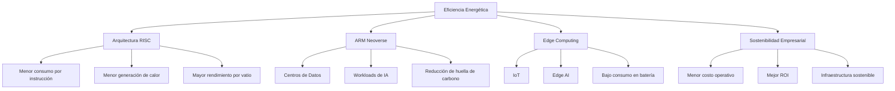

# Eficiencia energética como motor de innovación en ARM
La eficiencia energética no es solo una característica en la arquitectura **ARM**, sino el **motor principal de su innovación** y su ventaja competitiva fundamental 
en la era de la inteligencia artificial, la computación en la nube y el Internet de las Cosas. Con una herencia basada en el diseño de procesadores bajo consumo para 
dispositivos móviles, ARM ha trasladado este ADN de eficiencia a la infraestructura de centros de datos, permitiendo un rendimiento de vanguardia con un menor consumo 
energético y, por ende, una mayor sustentabilidad.

## Comparación Arquitectónica: ARM vs x86

| Característica              | ARM (RISC)                              | x86 (CISC)                              |
|-----------------------------|------------------------------------------|------------------------------------------|
| Tipo de arquitectura        | RISC (Instrucciones simples)             | CISC (Instrucciones complejas)           |
| Consumo energético          | Bajo                                     | Alto                                     |
| Generación de calor         | Menor                                    | Mayor                                    |
| Rendimiento por vatio       | Alto                                     | Medio                                    |
| Escalabilidad               | Alta (IoT → Data Center)                 | Principalmente Data Center               |
| Diseño de SoC personalizado | Flexible y modular                       | Más limitado                             |
| Aplicaciones comunes        | IoT, móviles, nube, Edge AI              | PCs tradicionales, servidores legacy     |

### 1. La Arquitectura RISC: La Base de la Eficiencia
- **Diseño de Conjunto de Instrucciones Reducido (RISC)**: A diferencia de la arquitectura x86 (CISC), ARM utiliza instrucciones más simples que requieren menos lógica de
- ejecución y, por lo tanto, generan menos calor y consumen menos energía por operación.
- **Mejor Rendimiento por Vatio**: La filosofía de ARM se centra en maximizar el rendimiento obtenido por cada vatio consumido, lo cual es crítico en servidores de centro de
- datos donde el costo eléctrico es una preocupación mayor.

### 2. Innovación en el Centro de Datos: ARM Neoverse
- **Neoverse N-Series y V-Series**: ARM ha rediseñado su infraestructura para la nube, ofreciendo procesadores que superan en eficiencia a las arquitecturas tradicionales.
- **Reducción de Huella de Carbono**: Los procesadores ARM Neoverse ofrecen hasta 3.5 veces más trabajo por vatio en cargas de trabajo de nube, ayudando a las empresas a reducir
- sus costos operativos y su impacto ambiental.
- **Escalabilidad en la IA**: Con el auge de la IA, los chips basados en ARM permiten procesar cargas de trabajo de aprendizaje automático (ML) de manera más eficiente, lo que es
- esencial para la sostenibilidad de la infraestructura física de la IA.  
### 3. Computación en el "Edge" y Movilidad
- **Ultra-bajo consumo**: En dispositivos IoT y sensores, la innovación de ARM se centra en la serie Cortex-M0+, permitiendo dispositivos que operan con baterías durante largos períodos.
- **IA de Borde (Edge AI)**: ARM impulsa la innovación local, donde la IA se ejecuta en el dispositivo (móvil, IoT) en lugar de en la nube, lo que reduce la latencia, mejora la privacidad
- y optimiza el uso de energía.
### 3. Sostenibilidad como Impulsor Empresarial 
- **Sostenibilidad y Costos**: La eficiencia energética permite a los grandes proveedores de la nube (hyperscalers) reducir costos operativos significativos, convirtiendo la sostenibilidad
- en un pilar del retorno de inversión (ROI).
- **Ecosistema abierto**: La flexibilidad de ARM permite a sus socios personalizar sus SoCs (System on a Chip), optimizando aún más el consumo energético para tareas específicas.

    ## Innovación ARM por Segmento

| Segmento           | Serie ARM          | Enfoque Principal                | Beneficio Clave |
|--------------------|-------------------|----------------------------------|------------------|
| IoT                | Cortex-M0+        | Ultra bajo consumo               | Batería prolongada |
| Móviles            | Cortex-A          | Balance rendimiento/energía      | Eficiencia en smartphones |
| Data Center        | Neoverse N-Series | Cloud computing eficiente        | Menor costo eléctrico |
| IA / ML            | Neoverse V-Series | Alto rendimiento para IA         | Mejor escalabilidad |
| Edge AI            | Cortex-A + NPU    | Procesamiento local              | Baja latencia y privacidad |

En conclusión, ARM utiliza la eficiencia energética para redefinir el rendimiento en todos los ámbitos, desde el dispositivo más pequeño hasta el centro de datos más potente, haciendo que la 
"IA en todas partes" sea posible de manera sostenible, incluso en infraestructuras que sería imposible de sostener con arquitecturas ineficientes.

### Fuentes bibliograficas
- Devmx. (2024, 2 septiembre). La Eficiencia Energética: Un Pilar Fundamental para la Innovación Sostenible en la Era Digital. Startup México. https://startupmexico.com/la-eficiencia-energetica-un-pilar-fundamental-para-la-innovacion-sostenible-en-la-era-digital/
- Arm Ltd. (s. f.). Neoverse N3. Arm | The Architecture For The Digital World. https://www.arm.com/products/silicon-ip-cpu/neoverse/neoverse-n3
- Arm Ltd. (s. f.-b). Scalable Computing Infrastructure and Networking for AI and Edge. Arm | The Architecture For The Digital World. https://www.arm.com/markets/computing-infrastructure
